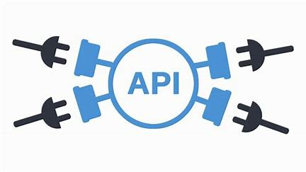

<h1 align="center">
 

</a>
    <br>APIForge
 
</h1>

                                                                       

<p align= "center">APIForge is a versatile API client generator designed to simplify the process of generating client code for various programming languages. With a focus on flexibility and extensibility, APIForge allows developers to define their API specifications in a structured format and automatically generate client libraries that are tailored to their needs. Whether you're working with REST, gRPC, or GraphQL APIs, APIForge provides a unified solution that streamlines the client generation process, saving time and reducing errors.</p>


## Features

- **Multi-Language Support**: Generate client libraries for multiple programming languages from a single API specification.
- **Flexible API Specification**: Define your APIs in JSON or YAML format for easy readability and customization.
- **Template System**: Use customizable templates to define how the client code should be generated, ensuring it meets your project’s standards.
- **Error Handling**: Robust error handling mechanisms to ensure that invalid API specifications are flagged during the generation process.
- **Unit Testing**: Comprehensive unit tests for each component to ensure reliability and correctness.
- **Extensible Architecture**: Easily add support for new API types or programming languages as your project evolves.
- **Documentation Generation**: Automatically generate documentation alongside the client libraries for better usability and maintainability.

## Installation

To get started with APIForge, follow these steps:

1. **Clone the Repository**:
   ```bash
   git clone https://github.com/Sanidhyafeaturist/APIForge.git
   cd APIForge
``

2. **Run Tests** (optional):
   To ensure everything is working as expected, run the tests:

   - For Python:
     ```bash
     python -m unittest discover
     ```

   - For JavaScript:
     ```bash
     npx mocha
     ```

   - For Go:
     ```bash
     go test ./...
     ```
## Usage

After successfully installing APIForge, you can start generating client code using the following steps:

1. **Define Your API Specification**:
   Create a JSON or YAML file that describes your API. Ensure it includes details like the API name, version, and endpoints.

   Example of a JSON specification:
   ```json
   {
       "name": "SampleAPI",
       "version": "1.0.0",
       "endpoints": [
           {
               "method": "GET",
               "path": "/users",
               "description": "Fetches a list of users"
           }
       ]
   }
**Note - you also need to specify the url in the json file** 

**Run the Generator**: 
Execute the API client generator with your specification file. The command may vary based on the specific component you are using.

For example:

```bash
(your preferred generator eg if you need to generate a c++ client you need to use Client_generator.exe) generate --spec path/to/your/api_spec.json
```

**Review the Generated Client Code**: 
Once the generation is complete, check the output directory for the generated client code. It will be organized by language and ready for use in your projects.

**Integrate the Client into Your Application**: 
Import the generated client code into your application and start making API calls.

## License
This Project is licensed by MIT License.

## Contributions

Contributions are welcomed but it should be relevent and whenever you contribute make sure to add your name and link to your github profile in the ```Contributers.md```.
Read ```Code Of Conduct``` for more details

